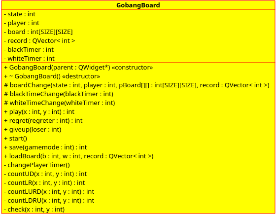
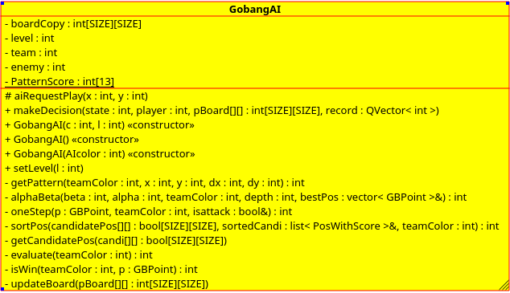
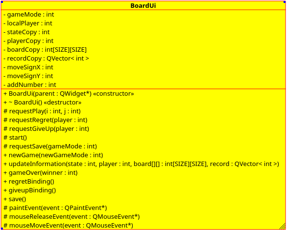
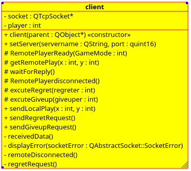
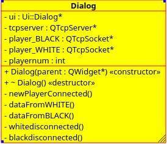

# 面向对象程序设计大程序文档
成员：
3150 范宏昌 
3150 方共凡
3150 杜众舒 
3140103103 郑济元 

## 总体概述及功能介绍
本五子棋游戏采用c++作为开发语言,使用了QT跨平台库，具有以下功能：

- 本机人人对战模式  
	1. 该模式下黑白两方玩家轮流在一个棋盘上下棋  
	2. 上一次落子的一方玩家可以进行悔棋  
	3. 轮到自己下棋的一方玩家可以进行认输  
	4. 游戏中途可以保存对局,可在以后选择加载对局  
	5. 游戏结束可以保存游戏棋谱(带落子顺序标记)  

- 本机人机对战模式
	1. 该模式下默认玩家执黑,电脑AI执白,轮流在一个棋盘上下棋  
	2. 玩家可以进行悔棋  
	3. 玩家可以进行认输  
	4. 游戏中途可以保存对局，可在以后选择加载对局  
	5. 游戏结束可以保存游戏棋谱(带落子顺序标记)  
- $网络人人对战模式^*$  
	1. 该模式下黑白两方玩家各自开一个客户端,连接上服务器后，分别在自己的棋盘上下棋  
	2. 任一方玩家可以在轮到自己下和轮到对方下时申请进行悔棋，待对方同意后即可悔棋  
	3. 任一方玩家可以在轮到自己下和轮到对方下时进行认输  
	4. 游戏结束可以保存游戏棋谱(带落子顺序标记)  

## 使用方法

## 组件（各类）间工作原理
* 人机对战AI  
围棋游戏中AI单独作为一个类，实例化为对象。AI对象拥有与board同步的棋盘拷贝，从而将AI的运算与棋盘隔离。  

	* AI类
   
		```
class GobangAI:public QObject
{
    	Q_OBJECT
	signals:
	    void aiRequestPlay(int x,int y);
	public slots:
	    void makeDecision(int state,int player,int pBoard[SIZE][SIZE],QVector<int> record); //对当前盘面做出决策
	public:
	    GobangAI(int c,int l);
	    GobangAI();
	    GobangAI(int AIcolor);
	    void setLevel(int l);
	    /* Make Decision*/
	private:
	    int getPattern(int teamColor,int x,int y,int dx,int dy);
	    int alphaBeta(int beta,int alpha,int teamColor,int depth,vector<GBPoint>& bestPos);
	    int oneStep(GBPoint p,int teamColor,bool& isattack);
	    int sortPos(bool candidatePos[SIZE][SIZE],list<PosWithScore>& sortedCandi,int teamColor);
	    void getCandidatePos(bool candi[SIZE][SIZE]);     //获得候选落子点
	    int evaluate(int teamColor);                      //评估函数，对盘面评分
	    int isWin(int teamColor,GBPoint p);
	    void updateBoard(int pBoard[SIZE][SIZE]);
	private:
	    int boardCopy[SIZE][SIZE];
	    int level;
	    int team;
	    int enemy;
	    static int PatternScore[13];
};
	```  
	**基本思路：**
	AI类隐藏了决策需要的各种方法，对外提供唯一的决策、以及难度level的设定接口。AI在构造时确定落子方，并根据输入的信息返回输出信息。
	
	* **决策** ：
	当棋盘发生变化时，发出boardChange信号，AI执行  
		
		```
  	void makeDecision(int state,int player,int pBoard[SIZE][SIZE],
   QVector<int> record);  
		```
	该成员函数的会根据信号传递的当前游戏状态、玩家、棋盘状态以及游戏记录做出反馈，若轮到AI方落子，则计算落子位置，并给棋盘发出落子信号。若为玩家落子则直接返回不作处理。
	
	* **博弈树**  
	在决策函数内部： 
	
		``` 
	 updateBoard(pBoard);
	 ...
	 vector<GBPoint> bestPos;
	 alphaBeta(INFINITY,-INFINITY,team,level,bestPos);
	 ...
    emit aiRequestPlay(x,y);
    
		```
	落子的计算由alphaBeta完成，该函数实现了博弈树的遍历以及Alpha-Beta剪枝。博弈树的实质是计算每一层的极大极小值。在博弈树中，从树根节点至叶节点依次表示AI以及人类对手，每一层之间则可以看做落子动作，因此整个搜索过程就是遍历各种落子的可能性，并在各种方案中选择较优方案。  
	如图所示，在树结构中，每一层都有该落子点的评分。每一层的落子方都会选择对自己最有利的落子点，即从子节点中选择对落子方来说的最高分。因此从AI的角度来看，**MIN层**（人类棋手）会选择子节点中的**最低分**作为本节点的分数；而在**MAX层**，其评分则选取子节点中的**最高分**。  
  
	Alpha-Beta剪枝的作用是减少不必要的搜索，提高效率。
	伪代码如下：
	
		```
	int alphaBeta(int beta,curColor,int alpha,int depth)
	{  
			if(depth==0) return evaluate(boardCopy)
			for every candidated position (x,y)
			{
				boardcopy[x][y] := curColor;
				val: = alphabeta(-alpha,-beta,enemyColor,depth-1);
				boardcopy[x][y] := EMPTY;	//reset
				if(val>beta) return beta   //cut-off
				if(val>alpha)
				{
					alpha:=beta;
					if(depth==initialDepth)	//the original depth
						setBestChoice(x,y);	
				}
			}
			return alpha;
	}
		```  
	采用取负值并交换alpha、beta的实现方式，由于棋手双方互相对立，在某一层发生剪枝的情况为在该位置落子，对方会存在一个落子点使得己方得分低于其余点的最低分。
	当递归至深度0（也可从0开始递归至最大深度），执行评价函数对当前局面打分，递归开始出栈，之后的每一个节点评分都从子节点的得分获取。
	* **评价函数**  
	评价函数采用分值表实现，首先要获取当前局面的棋子布局，调用:
	`int getPattern（int teamColor,int x,int y,int dx,int dy）`
	该函数对存在指定颜色棋子的每一个位置进行检查，检查的原则为**最左原则**，即对在一个方向上，从每个pattern中的最左边的棋子开始开始搜索，其余点不加判定。 
	 
		分值|Pattern|序号  
	----|--------------|------  
	 560|    L5 |       0  
    280|    L4 |      1  
    280|    D4 * 2 |   2  
    280|     D4 L3|     3  
    140|     L3 * 2 |   4    
    70|     D3 L3 |    5  
    60|     D4  |      6  
    50|     L3 |       7  
    40|     L2 * 2 |   8  
    30|     D3   |     9  
    20|     L2  |      10  
    10|     D2   |     11  
    0|     Single Piece  |    12 
    注：表格中L表示“活”，D表示“死”，如D4表示“死4”，有一端被对手拦截；D4*2表示“双死4”。棋局最终评分取所有pattern中最高值。此类评分表通常根据人的经验、或者机器学习优化参数的方法得到，因此带有一定主观因素。
    
    * **其他优化**  
	由于遍历博弈树的难度较大，因此增加部分额外处理优化性能。
	
		1. 选取部分落子点作为候选点：选取落子的位置的上下左右4x4范围。    
		2. 对候选节点单步评分并排序：优先搜索单步评分高的可以增加之后剪枝的概率。
		3. 对必胜/必输增加额外判定，直接选取该点作为落子点。

	
	
    
    


## 各类详细uml图
- GobangBoard(棋盘底层存储)

- GobangAI(电脑AI)

- BoardUi(棋盘界面)

- Client(客户端类)

- Dialog（带界面服务器类）

## 各源代码文件介绍
- 客户端部分主程序
`gobangclient/main.cpp`
- 定义了整个程序中用到的宏名
`gobangclient/marcos.h`
- 主窗口的头文件、cpp文件和ui设计文件
`gobangclient/mainwindow.h`，`gobangclient/mainwindow.cpp`，`gobangclient/mainwindow.ui`
- 棋盘界面类的头文件、cpp文件
`gobangclient/boardui.h`，`gobangclient/boardui.cpp`
- 客户端类的头文件、cpp文件
`gobangclient/client.h`，`gobangclient/client.cpp`
- 电脑AI类的头文件、cpp文件
`gobangclient/gobangai.h`，`gobangclient/gobangai.cpp`
- 棋盘底层存储类的头文件、cpp文件
`gobangclient/gobangboard.h`，`gobangclient/gobangboard.cpp`
- 服务器类头文件、cpp文件和ui设计文件
`gobangserver/dialog.h`，`gobangserver/dialog.cpp`，`gobangserver/dialog.ui`，
- 服务器端主程序
`gobangserver/main.cpp`

